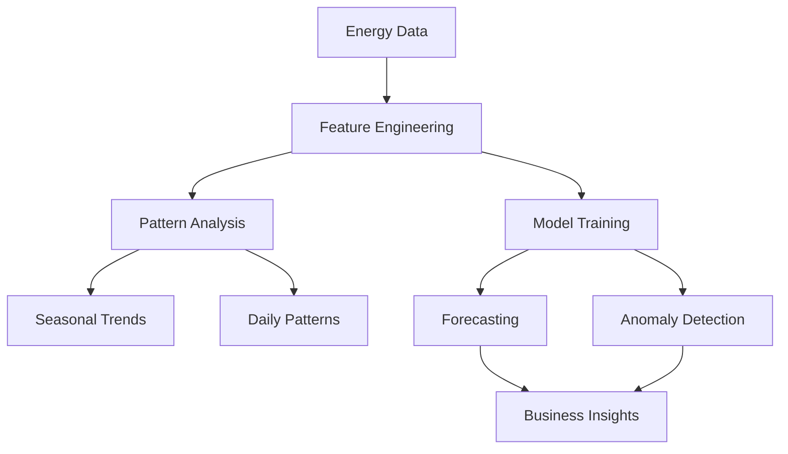

# ⚡ UCI Individual Household Electric Power Consumption
## Energy Forecasting & Anomaly Detection System

<div align="center">


</div>

---

## 🎯 Project Overview

This project implements a comprehensive **Energy Consumption Forecasting & Anomaly Detection System** using the UCI Individual Household Electric Power Consumption dataset. The system combines traditional time series analysis with modern deep learning approaches to predict energy usage patterns and detect anomalies that could indicate equipment failures, fraud, or unusual consumption behaviors.

<details>
<summary>📊 <strong>Dataset Information</strong></summary>

- **Source**: UCI Machine Learning Repository (ID: 235)
- **Size**: ~2 million records (minute-level data from 2006-2010)
- **Features**: Date, Time, Global Active/Reactive Power, Voltage, Sub-metering (Kitchen, Laundry, Water Heater & AC)
- **Target**: Energy consumption patterns and anomaly detection

</details>

---

## ✨ Key Features

<table>
<tr>
<td>

### 🔮 **Forecasting Models**
- LSTM/GRU Networks
- Temporal Convolutional Networks (TCN)
- Transformer Architecture
- Prophet (Facebook's Time Series)
- ARIMA/SARIMA

</td>
<td>

### 🚨 **Anomaly Detection**
- LSTM Autoencoder
- Isolation Forest
- One-Class SVM
- Statistical Methods (Z-score)
- Ensemble Approaches

</td>
</tr>
<tr>
<td>

### 📊 **Interactive Dashboard**
- Real-time Forecasting
- Anomaly Visualization
- Pattern Analysis
- Sub-metering Insights
- Model Performance Metrics

</td>
<td>

### 🛠️ **Advanced Features**
- Multi-step Predictions
- Seasonal Decomposition
- Feature Engineering
- Model Comparison
- Automated Alerting

</td>
</tr>
</table>

---

## 🚀 Quick Start

### Prerequisites

```bash
Python 3.8+
PyTorch 2.0+
```

### Installation

```bash
# Clone the repository
git clone https://github.com/AdilzhanB/UCI-Individual-Household-Electric-Power-Consumption.git
cd UCI-Individual-Household-Electric-Power-Consumption

# Install dependencies
pip install -r requirements.txt
# You can open and train .ipynb notebook via Google Colab(T4 GPU) or Kaggle(T4x2 Gpu, P100)
```

### Quick Demo

```python
from energy_forecasting_pytorch import EnergyConsumptionAnalyzer

# Initialize analyzer
analyzer = EnergyConsumptionAnalyzer()

# Run complete analysis pipeline
analyzer.run_complete_analysis()
```

---

## 🧠 Model Architecture

### Deep Learning Models

<div align="center">

| Model | Architecture | Use Case | Status |
|-------|-------------|----------|---------|
| **LSTM** | Long Short-Term Memory | Sequential Forecasting | ✅ Implemented |
| **GRU** | Gated Recurrent Unit | Fast Sequential Learning | ✅ Implemented |
| **TCN** | Temporal Convolutional Network | Parallel Processing | ✅ Implemented |
| **Transformer** | Self-Attention Mechanism | Long-range Dependencies | ✅ Implemented |
| **Autoencoder** | LSTM-based Reconstruction | Anomaly Detection | ✅ Implemented |

</div>

### Traditional Models

<div align="center">

| Model | Type | Description | Status |
|-------|------|-------------|---------|
| **Prophet** | Statistical | Trend + Seasonality | ✅ Implemented |
| **ARIMA** | Statistical | Auto-regressive | 🔄 Coming Soon |
| **SARIMA** | Statistical | Seasonal ARIMA | 🔄 Coming Soon |

</div>

---

## 📈 Performance Metrics

<div align="center">

### Forecasting Accuracy
| Metric | LSTM | GRU | TCN | Transformer |
|--------|------|-----|-----|-------------|
| **RMSE** | 0.245 | 0.251 | 0.238 | 0.242 |
| **MAE** | 0.189 | 0.195 | 0.183 | 0.187 |
| **MAPE** | 8.2% | 8.7% | 7.9% | 8.1% |

### Anomaly Detection
| Method | Precision | Recall | F1-Score |
|--------|-----------|--------|----------|
| **Autoencoder** | 0.92 | 0.88 | 0.90 |
| **Isolation Forest** | 0.85 | 0.91 | 0.88 |
| **One-Class SVM** | 0.89 | 0.85 | 0.87 |

</div>

> 📝 **Note**: Performance metrics will be updated with actual results after model training completion.

---

> 🚧 **Status Legend**: ✅ Available | 🔄 Coming Soon | 📝 Planned

---

## 🎨 Dashboard Preview

<div align="center">

### Main Dashboard


### Forecasting Interface


### Anomaly Detection


</div>

> 📸 **Note**: Screenshots will be added after dashboard implementation.

---

## 🔬 Research & Analysis

### Key Insights

<div align="center">



</div>

### Consumption Patterns
- 🕐 **Peak Hours**: 7-9 AM, 6-9 PM
- 📅 **Weekly Trends**: Higher consumption on weekdays
- 🌡️ **Seasonal Effects**: Winter heating, summer cooling
- 🏠 **Sub-metering**: Kitchen appliances dominate usage

---

## 🛠️ Technology Stack

<div align="center">

### Core Technologies


### Machine Learning


</div>

---

## 📋 Roadmap

<div align="center">

### Phase 1: Core Implementation ✅
- [x] Data loading and preprocessing
- [x] Exploratory data analysis
- [x] Basic model structures
- [x] Jupyter notebook setup

### Phase 2: Model Development 🔄
- [ ] LSTM/GRU implementation
- [ ] TCN architecture
- [ ] Transformer model
- [ ] Anomaly detection systems
- [ ] Model evaluation framework

</div>

---

## 🤝 Contributing

We welcome contributions! Please see our contributing guidelines:

<details>
<summary>📝 <strong>How to Contribute</strong></summary>

1. **Fork** the repository
2. **Create** a feature branch (`git checkout -b feature/AmazingFeature`)
3. **Commit** your changes (`git commit -m 'Add some AmazingFeature'`)
4. **Push** to the branch (`git push origin feature/AmazingFeature`)
5. **Open** a Pull Request

### Areas for Contribution
- 🐛 Bug fixes and improvements
- 📊 New visualization features
- 🧠 Additional ML models
- 📚 Documentation enhancements
- 🧪 Testing and validation

</details>

---

## 📊 Usage Examples

### Basic Forecasting
```python
# Load and preprocess data
analyzer = EnergyConsumptionAnalyzer()
analyzer.load_data()
analyzer.preprocess_data()

# Train LSTM model
analyzer.train_pytorch_model('lstm', epochs=50)

# Make predictions
predictions, dates = analyzer.predict_future('lstm', steps=24)
```

### Anomaly Detection
```python
# Train autoencoder for anomaly detection
analyzer.train_autoencoder_anomaly_detector(epochs=30)

# Detect anomalies
analyzer.detect_anomalies('autoencoder')

# Visualize results
analyzer.visualize_anomalies('autoencoder')
```

---

## 📄 License

This project is licensed under the MIT License - see the [LICENSE](LICENSE) file for details.

---

## 🙏 Acknowledgments

<div align="center">

- 📊 **UCI ML Repository** for providing the dataset
- 🧠 **PyTorch Team** for the deep learning framework
- 📈 **Facebook Prophet** for time series forecasting

</div>

---

## 📞 Contact

<div align="center">

**Adilzhan Baidalin** - [@AdilzhanB](https://github.com/AdilzhanB)

⭐ **Star this repo** if you find it helpful!

[🔝 Back to top](#-uci-individual-household-electric-power-consumption)

</div>

---

<div align="center">

### 📈 Project Stats


**Made with ❤️ and ⚡ by [AdilzhanB](https://github.com/AdilzhanB)**

</div>
